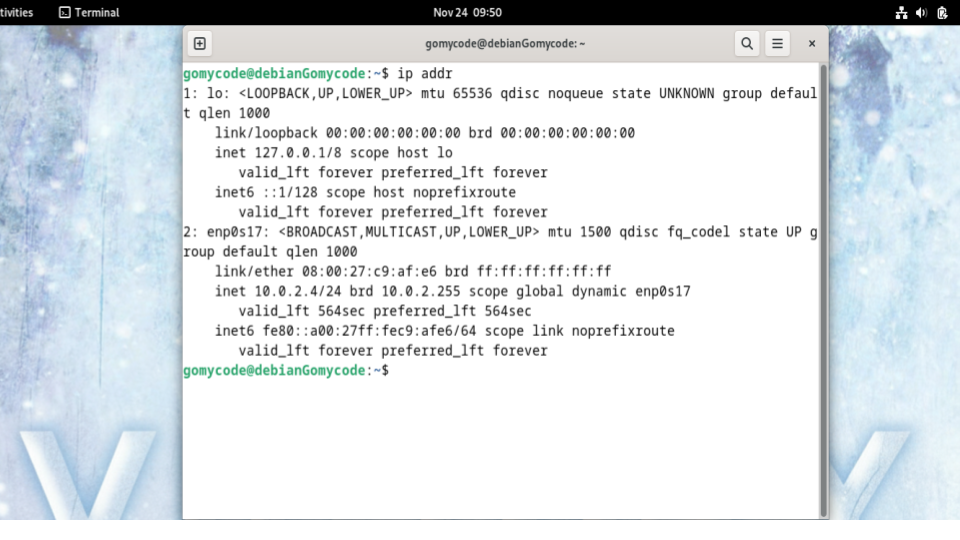
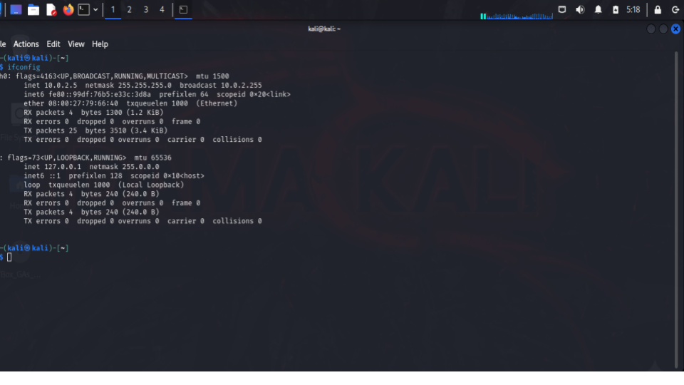

# Module 2: Networking

## Objective
To understand basic networking concepts and how devices communicate
over a network.

## Key Concepts Covered
- Types of networks (LAN, WAN, MAN)
- IP addressing and subnetting
- Network devices (router, switch, firewall)
- Common networking protocols (TCP/IP, HTTP, HTTPS, DNS)

## What I Learned
- How data moves across networks
- The role of IP addresses and ports
- Differences between TCP and UDP
- How networking knowledge supports cybersecurity operations

## Evidence

## Summary
This checkpoint strengthened my understanding of networking fundamentals,
which are essential for detecting, analyzing, and defending against cyber threats.
