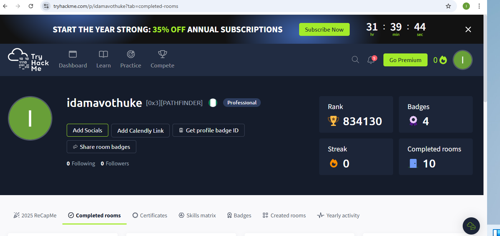

# TryHackMe Portfolio

This section documents my hands-on cybersecurity learning using TryHackMe.

🔗 TryHackMe Profile:
(https://tryhackme.com/p/idamavothuke)

## What I Practiced
- Networking fundamentals
- Linux and Windows basics
- Blue Team security concepts
- Threat detection and analysis

## Tools Used
- Nmap
- Wireshark
- Burp Suite
- Linux command line
# TryHackMe Practical Labs

I actively practice hands-on cybersecurity labs using TryHackMe to strengthen my technical skills.

🔗 **TryHackMe Profile:**  
https://tryhackme.com/p/idamavothuke

## Areas Covered
- Networking fundamentals
- Linux & Windows basics
- Threat detection
- Blue Team security concepts
- Security tools and techniques

- ## Profile Overview

